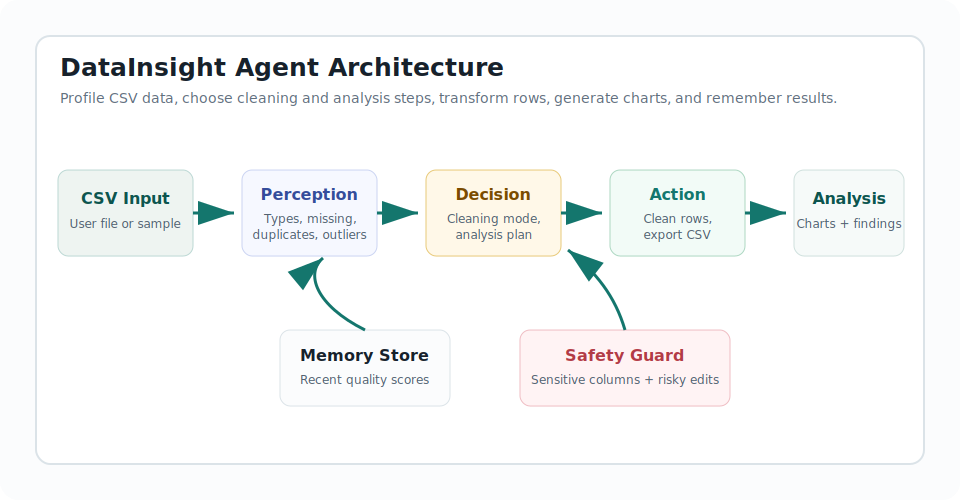

# DataInsight Agent

GitHub repository link: [https://github.com/dsfga/datainsight-agent](https://github.com/dsfga/datainsight-agent)

Demo video link: [demo/datainsight-demo.mp4](demo/datainsight-demo.mp4)

DataInsight Agent is an intelligent CSV cleaning and analysis agent prototype for COMPSCI 767 Assignment 2. It reads a CSV file, profiles data quality issues, decides cleaning and analysis steps, acts by transforming the dataset and generating charts, and stores recent analysis checkpoints in local browser memory.



## Agent Capabilities

- **Perception:** detects columns, data types, missing values, duplicate rows, category inconsistencies, outliers, and possible sensitive columns.
- **Decision making:** chooses cleaning actions based on conservative, balanced, or aggressive mode.
- **Action:** removes duplicates, fills missing values, standardizes categories, flags or caps outliers, generates charts, summarizes findings, and exports cleaned CSV.
- **Memory:** stores recent quality scores, dataset names, modes, and headline findings in `localStorage`.
- **Safety:** warns users to use non-sensitive local data and marks higher-risk cleaning operations such as numeric imputation and outlier capping.

## Reproduction Instructions

1. Install Node.js and Python 3.
2. Clone the repository.
3. From the repository root, run:

```bash
npm test
python -m http.server 8765
```

4. Open [http://localhost:8765](http://localhost:8765).
5. Click **Load Sample**, then **Run Agent**.
6. Try changing **Cleaning mode** to **Aggressive** and run again.
7. Click **Cleaned CSV** to download the transformed dataset.

No API keys or external services are required.

## Assignment Report

- DOCX report: [report/DataInsight_Report.docx](report/DataInsight_Report.docx)
- PDF preview: [report/DataInsight_Report.pdf](report/DataInsight_Report.pdf)
- Screenshots: [balanced mode](assets/screenshot-balanced.png), [analysis crop](assets/screenshot-analysis.png), [results view](assets/screenshot-results.png), and [aggressive mode](assets/screenshot-aggressive.png)

## Design Evolution Checkpoints

The local Git history contains brief checkpoints:

1. Scaffolded the DataInsight agent core, CSV parser, and sample dirty dataset.
2. Added the browser UI, chart rendering, memory, responsive layout, and tests.
3. Added report, screenshots, demo video, and reproduction documentation.
4. Polished the dashboard UI with refined spacing, card hierarchy, responsive behavior, and refreshed visual evidence.

## Project Structure

```text
.
|-- assets/                 # System design diagram and screenshots
|-- data/                   # Sample dirty CSV
|-- demo/                   # Demo video and narration script
|-- report/                 # Two-page assignment report
|-- scripts/                # Report and video generation scripts
|-- src/                    # Agent logic, CSV parser, and UI controller
|-- tests/                  # Node test suite
|-- index.html              # Main app
|-- styles.css              # Responsive UI styles
`-- package.json            # Test and start scripts
```

## Notes for Submission

If you publish the repository under a different name, update the GitHub link in this README and on page 1 of the report.
